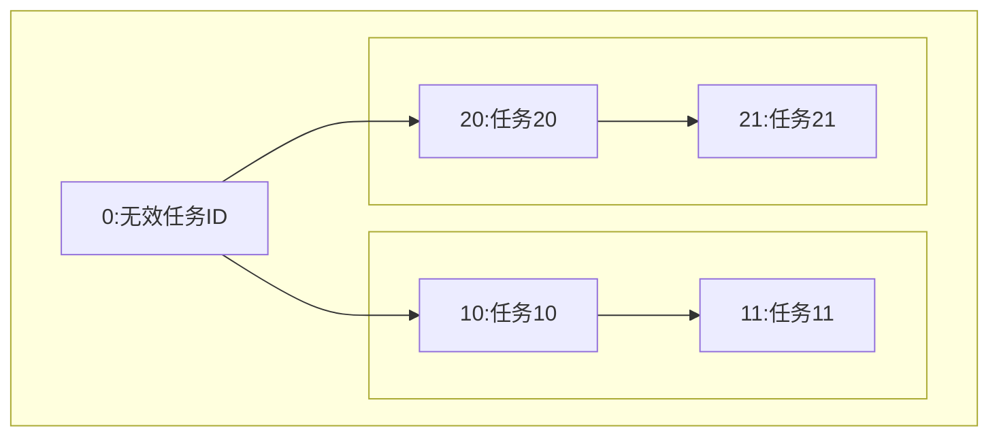

将Excel任务表中的关系转换成Markdown的mermaid图，方便使用Markdown工具直观地查看任务依赖。
命令格式：excelTask2md -hr [字段所在行号] -dr [数据起始行号] [-nc]  -id [任务ID字段名] -t [任务标题字段名] -pid [前置任务ID字段名] -o <输出文件> <Excel文件路径>

Excel表格式如下：

| TaskID | TaskTitle | PreTask |
| ------ | --------- | ------- |
| 10     | 任务10    | 0       |
| 20     | 任务20    | 0       |
| 11     | 任务11    | 10      |
| 21     | 任务21    | 20      |

生成如下所示mermaid图：

